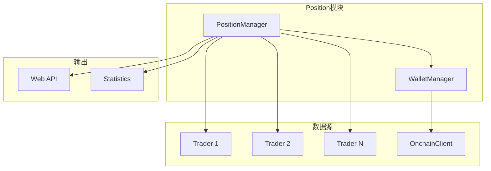

# Position 模块

## 概述

Position 模块负责跨交易所和链上的仓位聚合分析和查询。它整合了 CEX 持仓、链上代币余额、钱包信息等数据，提供统一的仓位视图。

## 核心功能

- **仓位聚合**：聚合多个交易所和链上的持仓数据
- **钱包管理**：管理多个钱包的余额信息
- **统计计算**：计算总持仓、盈亏等统计数据
- **定时刷新**：定时更新仓位和余额数据

## 架构图



## 关键文件

| 文件 | 职责 |
|------|------|
| `position_manager.go` | PositionManager 主实现 |
| `wallet_info.go` | WalletManager 实现 |
| `position.go` | Position 相关结构和方法 |
| `interfaces.go` | 接口定义 |
| `statistics.go` | 统计计算 |

## API 说明

### PositionManager 结构

```go
type PositionManager struct {
    walletManager      *WalletManager
    trackedSymbols     map[string]bool
    analyticsProviders map[string]analytics.Analyzer
    onchainTraders     map[string]trader.OnchainTrader
    latestPrices       map[string]*model.PriceData
}
```

### 主要方法

| 方法 | 说明 |
|------|------|
| `GetSymbolPositionSummary(symbol)` | 获取某个交易对的持仓汇总 |
| `GetAllPositionSummaries()` | 获取所有交易对的持仓汇总 |
| `TrackSymbol(symbol)` | 开始跟踪某个交易对 |
| `UntrackSymbol(symbol)` | 停止跟踪某个交易对 |
| `SetAnalyticsProvider(symbol, analyzer)` | 设置分析器 |
| `SetOnchainTrader(symbol, trader)` | 设置链上 Trader |

### SymbolPositionSummary 结构

```go
type SymbolPositionSummary struct {
    Symbol string
    
    // 交易所持仓汇总
    TotalExchangeLongSize      float64
    TotalExchangeShortSize     float64
    TotalExchangeLongValue     float64
    TotalExchangeShortValue    float64
    TotalExchangeUnrealizedPnl float64
    
    // 链上余额汇总
    TotalOnchainBalance float64
    TotalOnchainValue   float64
    
    // 总汇总
    TotalQuantity float64
    TotalValue    float64
    
    // 详情
    ExchangePositions []*ExchangePositionDetail
    OnchainBalances   []*OnchainBalanceDetail
}
```

### WalletManager

```go
type WalletManager struct {
    traders        []trader.Trader
    onchainClients map[string]*OnchainClientConfig
    refreshInterval time.Duration
}
```

## 使用示例

### 初始化 PositionManager

```go
import "auto-arbitrage/internal/position"

// 准备 Traders
traders := []trader.Trader{binanceTrader, bybitTrader}

// 准备链上客户端配置
onchainClients := map[string]*position.OnchainClientConfig{
    "bsc": {
        ChainIndex:    "56",
        WalletAddress: "0x...",
    },
}

// 初始化
pm := position.InitPositionManager(traders, onchainClients, 5*time.Second)
```

### 获取持仓汇总

```go
// 获取单个交易对
summary, err := pm.GetSymbolPositionSummary("BTCUSDT")
if err != nil {
    log.Printf("获取失败: %v", err)
    return
}

fmt.Printf("BTCUSDT 总持仓: %f\n", summary.TotalQuantity)
fmt.Printf("交易所多头: %f\n", summary.TotalExchangeLongSize)
fmt.Printf("链上余额: %f\n", summary.TotalOnchainBalance)

// 获取所有交易对
summaries := pm.GetAllPositionSummaries()
for _, s := range summaries {
    fmt.Printf("%s: 总价值 %f\n", s.Symbol, s.TotalValue)
}
```

### 跟踪交易对

```go
// 开始跟踪
pm.TrackSymbol("ETHUSDT")

// 设置分析器
pm.SetAnalyticsProvider("ETHUSDT", ethAnalyzer)

// 设置链上 Trader
pm.SetOnchainTrader("ETHUSDT", ethOnchainTrader)
```

## 设计决策

### 1. 单例模式
PositionManager 使用单例模式，确保全局唯一实例。

### 2. 定时刷新
后台定时刷新仓位和余额数据，减少实时查询压力。

### 3. 聚合视图
将 CEX 持仓和链上余额聚合到统一的视图，便于分析。

### 4. 分离关注点
WalletManager 专注于钱包余额管理，PositionManager 专注于持仓聚合。

## 依赖关系

### 依赖的模块
- `trader` - 获取持仓和余额
- `analytics` - 价格分析
- `model` - 数据模型
- `statistics` - 统计数据
- `onchain` - 链上余额查询

### 被依赖的模块
- `web` - 提供持仓 API
- `trigger` - 仓位检查

## 扩展指南

### 添加新的数据源

1. 实现 `Trader` 接口
2. 在初始化时传入 traders 列表
3. PositionManager 会自动聚合数据

### 自定义聚合逻辑

1. 修改 `GetSymbolPositionSummary` 方法
2. 添加新的聚合字段到 `SymbolPositionSummary`

## 变更历史

参见 [CHANGELOG](../../docs/CHANGELOG.md)
