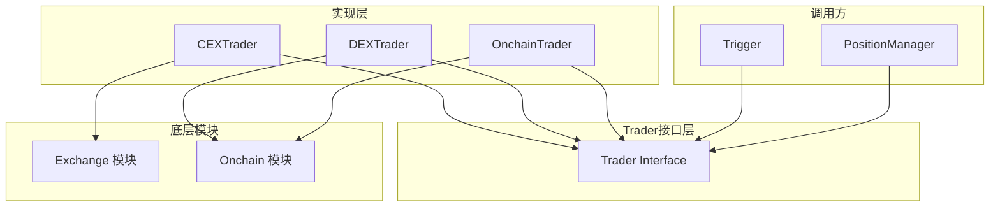

# Trader 模块

## 概述

Trader 模块是交易执行的抽象层，提供统一的交易接口，屏蔽 CEX（中心化交易所）和 DEX（去中心化交易所）的差异。所有交易操作都通过 Trader 接口进行，实现了交易逻辑与具体交易所实现的解耦。

## 核心功能

- **统一接口**：为 CEX 和 DEX 提供统一的交易接口
- **价格订阅**：统一的价格数据订阅和回调机制
- **订单执行**：统一的下单接口
- **余额查询**：统一的账户余额查询
- **滑点计算**：统一的滑点计算接口

## 架构图



## 关键文件

| 文件 | 职责 |
|------|------|
| `interface.go` | Trader 接口定义 |
| `cex_trader.go` | CEX Trader 实现（封装 Exchange） |
| `dex_trader.go` | DEX Trader 实现 |
| `onchain_trader.go` | 链上 Trader 实现（封装 OnchainClient） |

## API 说明

### Trader 接口

```go
type Trader interface {
    // 订阅价格数据
    Subscribe(symbol string, marketType string) error
    Unsubscribe(symbol string, marketType string) error
    
    // 设置价格回调
    SetPriceCallback(callback PriceCallback)
    
    // 执行订单
    ExecuteOrder(req *model.PlaceOrderRequest) (*model.Order, error)
    
    // 余额查询
    GetBalance() (*model.Balance, error)
    GetAllBalances() (map[string]*model.Balance, error)
    GetSpotBalances() (map[string]*model.Balance, error)
    GetFuturesBalances() (map[string]*model.Balance, error)
    
    // 持仓查询
    GetPosition(symbol string) (*model.Position, error)
    GetPositions() ([]*model.Position, error)
    
    // 订单簿和滑点
    GetOrderBook(symbol string, isFutures bool) (bids, asks [][]string, err error)
    CalculateSlippage(symbol string, amount float64, isFutures bool, 
                      side model.OrderSide, slippageLimit float64) (float64, float64)
    
    // 类型和初始化
    GetType() string
    Init() error
}
```

### OnchainTrader 扩展接口

```go
type OnchainTrader interface {
    Trader
    
    // 链上特有方法
    StartSwap(swapInfo *model.SwapInfo)
    BroadcastSwapTx(direction onchain.SwapDirection) (string, error)
    GetTxResult(txHash, chainIndex string) (model.TradeResult, error)
    ExecuteOnChain(chainIndex string, direction onchain.SwapDirection) (string, *OnchainTradeResult, error)
    
    // Swap 信息管理
    GetLatestSwapTx() interface{}
    GetSwapInfo() *model.SwapInfo
    UpdateSwapInfoAmount(amount string)
    UpdateSwapInfoDecimals(decimalsFrom, decimalsTo string)
    UpdateSwapInfoSlippage(slippage string)
    
    // Nonce 管理
    ResetNonce(walletAddress, chainIndex string)
}
```

### PriceData 结构

```go
type PriceData struct {
    Ticker     *model.Ticker          // 交易所价格数据
    ChainPrice *model.ChainPriceInfo  // 链上价格数据
}
```

## 使用示例

### 创建 CEX Trader

```go
// 创建 Binance 交易所实例
binanceEx := binance.NewBinance(apiKey, secret)
binanceEx.Init()

// 创建 CEX Trader
cexTrader := trader.NewCEXTrader(binanceEx)

// 设置价格回调
cexTrader.SetPriceCallback(func(symbol string, priceData trader.PriceData) {
    fmt.Printf("收到价格: %s, Bid: %f, Ask: %f\n", 
        symbol, priceData.Ticker.BidPrice, priceData.Ticker.AskPrice)
})

// 订阅价格
cexTrader.Subscribe("BTCUSDT", "futures")
```

### 创建 Onchain Trader

```go
// 创建链上客户端
okdex := onchain.NewOKDex(config)
okdex.Init()

// 创建 Onchain Trader
onchainTrader := trader.NewOnchainTrader(okdex)

// 启动 Swap
swapInfo := &model.SwapInfo{
    FromTokenSymbol: "USDT",
    ToTokenSymbol:   "BTC",
    ChainIndex:      "56",
    Amount:          "1000",
}
onchainTrader.StartSwap(swapInfo)
```

### 执行订单

```go
// 构建订单请求
req := &model.PlaceOrderRequest{
    Symbol:   "BTCUSDT",
    Side:     model.OrderSideBuy,
    Type:     model.OrderTypeMarket,
    Quantity: 0.01,
}

// 执行订单
order, err := trader.ExecuteOrder(req)
if err != nil {
    log.Printf("下单失败: %v", err)
    return
}
fmt.Printf("订单成功: %s\n", order.OrderID)
```

## 设计决策

### 1. 接口抽象
通过 Trader 接口统一 CEX 和 DEX 的操作，上层模块（如 Trigger）无需关心具体实现。

### 2. 扩展接口
OnchainTrader 扩展了 Trader 接口，添加链上特有的方法，保持接口的清晰和职责分离。

### 3. 价格回调统一
使用统一的 PriceData 结构，可以同时承载交易所价格和链上价格。

### 4. 类型标识
通过 `GetType()` 方法返回类型标识（如 "binance:futures"、"onchain:56"），便于区分和路由。

## 依赖关系

### 依赖的模块
- `exchange` - CEX 交易所实现
- `onchain` - 链上操作实现
- `model` - 数据模型

### 被依赖的模块
- `trigger` - 触发器使用 Trader 执行交易
- `position` - 仓位管理使用 Trader 查询余额和持仓

## 扩展指南

### 添加新的 Trader 类型

1. 实现 `Trader` 接口
2. 如果是链上类型，实现 `OnchainTrader` 接口
3. 在工厂方法中添加创建逻辑

### 添加新的接口方法

1. 在 `interface.go` 中添加方法定义
2. 在所有实现中添加对应实现
3. 更新文档

## 变更历史

参见 [CHANGELOG](../../docs/CHANGELOG.md)
