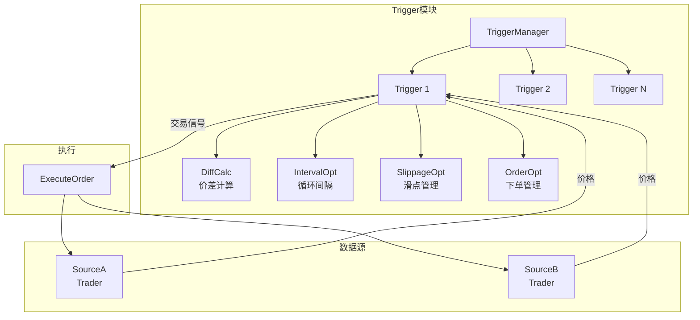

# Trigger 模块

## 概述

Trigger 模块是套利系统的核心模块，负责价差监控、触发判断和交易信号生成。它实时计算两个交易源（CEX/DEX）之间的价差，当价差满足阈值条件时触发交易执行。

## 核心功能

- **价差监控**：实时计算 `+A-B` 和 `-A+B` 两个方向的价差
- **触发判断**：根据阈值判断是否触发交易
- **交易信号生成**：生成开仓/平仓信号
- **执行时序控制**：控制交易执行顺序，确保对冲成功
- **多模式支持**：支持即时触发和定时触发两种模式

## 架构图



## 关键文件

| 文件 | 职责 |
|------|------|
| `trigger.go` | Trigger 核心结构和主循环逻辑 |
| `manager.go` | TriggerManager，管理多个 Trigger 实例 |
| `diffcalc.go` | 价差计算逻辑 |
| `execute_order_V2.go` | 订单执行逻辑 |
| `option.go` | Trigger 配置选项 |
| `api.go` | 对外 API 接口 |
| `token_mapping/` | Token 地址到符号的映射管理 |
| `contract_mapping/` | 合约映射管理 |

## API 说明

### Trigger 结构体

```go
type Trigger struct {
    ID      uint64
    sourceA trader.Trader    // 交易源 A
    sourceB trader.Trader    // 交易源 B
    symbol  string           // 交易对符号
    mode    TriggerMode      // 触发模式

    directionAB *DirectionConfig  // +A-B 方向配置
    directionBA *DirectionConfig  // -A+B 方向配置
    
    analytics analytics.Analyzer  // 分析器
}
```

### 主要方法

| 方法 | 说明 |
|------|------|
| `Start()` | 启动触发器 |
| `Stop()` | 停止触发器 |
| `GetSymbol()` | 获取交易对符号 |
| `GetStatus()` | 获取触发器状态 |
| `SetThreshold()` | 设置触发阈值 |
| `EnableDirection()` | 启用/禁用某个方向 |

### TriggerManager 接口

```go
type TriggerManager interface {
    CreateTrigger(config *TriggerConfig) (*Trigger, error)
    GetTrigger(symbol string) (*Trigger, error)
    ListTriggers() []*Trigger
    DeleteTrigger(symbol string) error
}
```

## 使用示例

### 创建 Trigger

```go
// 获取 TriggerManager
tm := trigger.GetTriggerManager()

// 创建 Trigger
config := &trigger.TriggerConfig{
    Symbol:  "BTCUSDT",
    SourceA: binanceTrader,
    SourceB: onchainTrader,
    Mode:    trigger.ModeInstant,
}
t, err := tm.CreateTrigger(config)
if err != nil {
    log.Fatal(err)
}

// 启动
t.Start()
```

## 设计决策

### 1. 双向配置分离
每个方向（+A-B 和 -A+B）独立配置，支持不同的阈值和启用状态。

### 2. 触发模式
- **即时触发（ModeInstant）**：价差变化立即触发
- **定时触发（ModeScheduled）**：按固定间隔检测

### 3. 滑点管理
集成滑点计算和管理，在下单前预估滑点。

## 依赖关系

### 依赖的模块
- `trader` - 交易执行接口
- `analytics` - 参数分析
- `model` - 数据模型
- `position` - 仓位管理
- `statistics` - 统计监控

### 被依赖的模块
- `web` - Web Dashboard 通过 proto 接口调用
- `cmd/arbitrage` - 主程序入口

## 变更历史

参见 [CHANGELOG](../../docs/CHANGELOG.md)